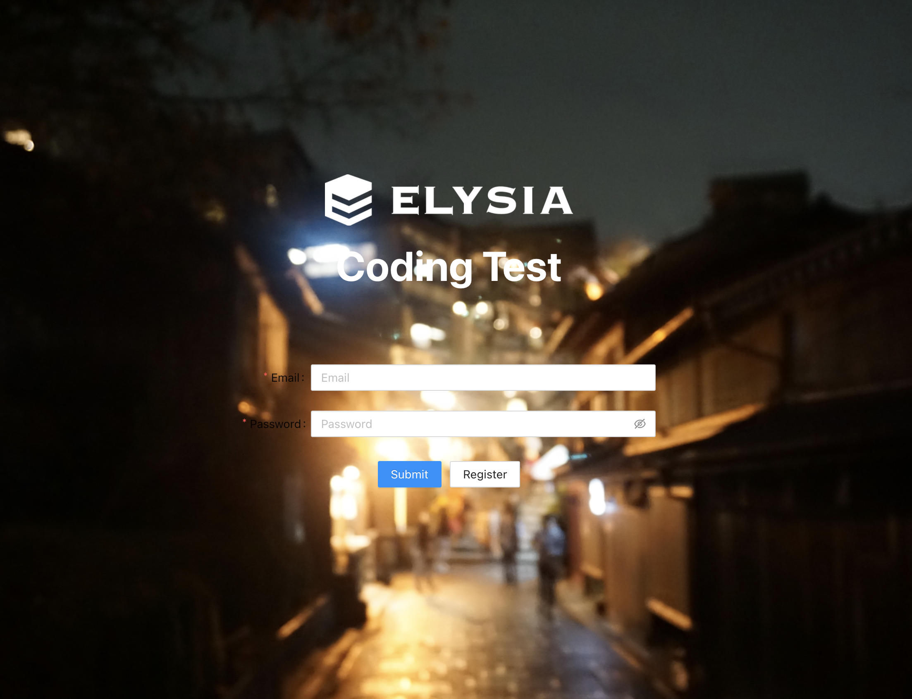

# 코딩 테스트

## 사용한 프레임워크

- React.js
- ant-Design ( styled-components )
   

## 토큰을 저장하는 방법

### 쿠키와 HEADER에 저장

>     
> 1. 쿠키에 저장을 할 때 옵션으로 HttpOnly를 설정하면 자바스크립트르 접근이 불가능합니다. Secure 옵션을 주게 되면 쿠키는 HTTPS 통신으로만 전송되기 때문에 보안 수준을 한 단계 더 높여줄 수 있다.
>      
> 2. 쿠키를 이용할 경우 CSRF공격에 취약하기 때문에 CORS를 적용시켜 허용한 사이트 외에 접근을 못하도록 합니다.
>      
> 3. auhorization에 같이 저장을 한 뒤 토큰검증을 할 때 authorization을 이용합니다.
>      
> 4. 토큰이 만료 되었을 때는 쿠키에 refreshToken이 있다면 refreshToken을 이용하여 다시 accessToken 재발급 받습니다.
>      

 

### 세션 스토리지와 로컬 스토리지를 사용하지 않은 이유

>     
> 1. 세션 스토리지는 서버에 접근할 수 없고 세션이 종료되면 저장된 것은 모두 삭제가 됩니다.
>      
> 2. 로컬 스토리지는 만료시간이 지나면 삭제되지만 데이터는 반영구적으로 저장이 가능합니다. 세션 스토리지와 마찬가지로 서버에 접근 할 수가 없습니다.
>      
> 3. 자바스크립트로 제어가 가능하기때문에 세션 스토리지와 로컬 스토리지는 XSS 공격과 CSRF 공격에 취약하여 보안상 좋지 않다고 생각하여 사용하지 않았습니다.
>      

## 페이지 기능 및 에러 처리

1. 회원가입 기능
   > - 아이디 / 이름 / 패스워드 입력하여 데이터를 전달
   > - 패스워드가 일치하지 않거나 증복된 아이디가 있으면 alert 창으로 에러 표시
2. 로그인 기능
   > - 로그인시 이메일과 패스워드 모두 일차하지 않으면 로그인이 안됩니다.
   > - 로그인 성공시 액세스 토큰을 발급받아 cookie와 authorization에 저장합니다. 유저정보는 리덕스에서 상태를 관리합니다.
   > - 메인화면에 프로필이 보이고 이름과 이메일이 표시됩니다.
3. 정보수정 기능
   > - 유저정보를 리덕스에서 가져와 이름과 이메일을 넣고 수정이 가능합니다.
   > - 패스워드는 수정이 불가능하며 이메일과 이름만 수정이 가능합니다.
   > - 원래 패스워드를 입력을 해야만 수정이 가능합니다.
4. 로그아웃 기능
   > - 로그아웃을 하면 토큰을 전부 삭제하도록 구현하였습니다.

에러처리는 try catch 문을 사용하였습니다. 기능들 마다 alert창을 이용하여 표시하도록 했습니다.

## 웹페이지 구동 방법

    git clone https://github.com/ggyu-s/elysia-test.git

testback 폴더와 testfront 폴더에 각각 들어갑니다. 

    npm install

testback에서 실행 

    npm run start-auth

testfront에서 실행 

    npm run start

## 작동하는 코드
